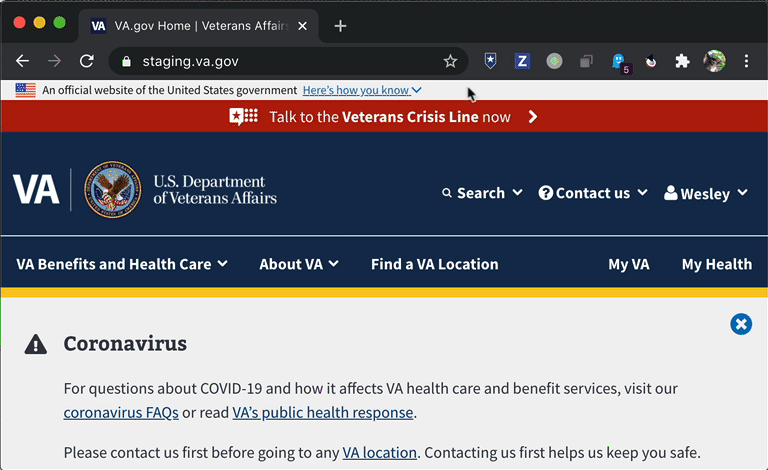
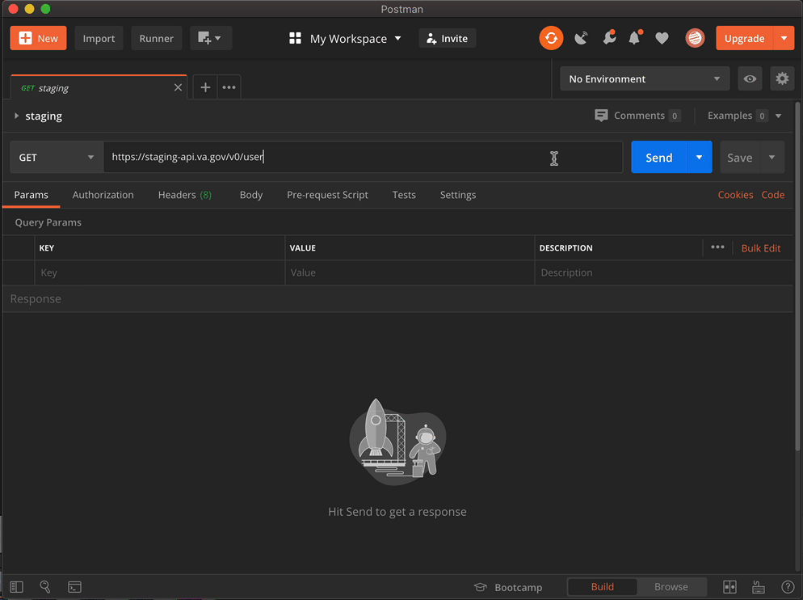

# VA.gov session cookies Chrome extension

This is a Chrome extension that makes it a little easier to test user auth endpoints for VA.gov locally with a REST client like [Paw](https://paw.cloud/) or [Postman](https://www.getpostman.com).

## The Problem

When testing VA.gov user API endpoints (such as `GET v0/user` and `POST v0/notifications/dismissed_statuses`) in a REST client, you need to send the `api_session` and `vagov_session_dev` cookies with any request. You do this by creating a single header named `Cookie` to pass along the value of those cookies.

An example of the value for the `Cookie` header for local testing would be:

```text
api_session=MU8xTVEvSFpNOUg1bmZocTZIcytRY091eWE5S3pNKzVtdEF2alVUTiswN2l0N0JTcHJodE5QZUl6aWlNbWg3ZENsZW0yRFFhc0xYMWp6UFJLc0t3bXBiRmdHWjNVMFBvWitqa3BGMG0zZ281QTNZSEVUaDErY3E4bDlNVHNYcG1TcnVZaXZaQ1dvNDNJRW1MLys3TjlKbUxpaW0rTE1xWVZvZnppcVF6MVZBRTZtZTc5QVhqVklHR2FSSmo3bTUyN1ZycTF0QmloeHVpVWgwbHhWWWViK0dKWTQ3K1dBbHFWRU40NmptMjladXN2SHBHckMveXkxOVZ3L2Jab1llZmFyeWNRUEpRaVY5cW1nUjdmSXpXZ3diajZXYStta2w5SVp6bFpmdGJ4ODlVSVF5Y2FidWZ4Q2cwMllKRE44bUNGbUR2MTFOZXl1NkdqcEtuWGNTVnpjcCtWY25GTHIvNUpKeUdGdDZZWVY0PS0ta0MyNncrb2pxNFM4S2xNRTc1VkZkUT09--068924b4abb306a7eb1b0138477b740c70f1dc68; vagov_session_dev=fzdVGr0CT1FgDv_SxjWQty1LfIF5Vgcmj9OgWC-VFx6Liyt8YkrIgjCr6NFFx__Snv9DRG61DNIRwjot-JpA6sT2S1xP17YgD4mmKI9r5XX8x4lzZp0U5LtoBBfSHRqlOlWQmVFbIEc4aQP8kxhv7o91Duu997raWNyKizUmCoVJ-H_wVWCQI-tdn48jPyNT0Wi-Y-Cq-EbFtcfDDQX0LVqpTlTaIPd_QgjuY9v1Kn96p0EcBQwJzjFv28hv9KEx
```

Because valid values change whenever you sign in, updating the `Cookie` header is a pain; you need to copy the current cookie values from the web inspector and paste them into the long string shown above. This is slow, tedious, and error-prone. Mostly slow. And oh so tedious.

## The Solution

This Chrome extension aims to make it easier to update the `Cookie` header in a REST client like Postman or Paw. Once you are signed into VA.gov (in either the prod, staging, dev, or local environments), click on the extension's icon. This will copy the current cookie values to your clipboard.



Then, in your REST client, paste the clipboard contents into the value of the `Cookie` header. Voilà! You can now make user-authenticated requests from your REST client.



## Installation

First, clone this repo to someplace on your computer.

Then install it in Chrome as an "unpacked extension"<sup>[1](#footnote1)</sup>:

1. Open the Extension Management page by navigating to `chrome://extensions`.
2. Enable Developer Mode by clicking the toggle switch next to Developer mode.
3. Click the LOAD UNPACKED button and select the extension directory (where you cloned this repo to on your computer).

## Notes

- This is my first Chrome extension so I'm open to suggestions for improvement.
- I wanted to make this a single-click operation that didn't require a popup menu. But since I'm relying on the `navigator.clipboard` API, I need to embed the relevant code into a popup HTML page :(
- Now that I've done this, I wonder if Chrome has a command-line API that would let me grab the cookies so that this could be done in a shell script.

---

<a name="footnote1">1</a>: Instructions copied from the [Chrome developer site](https://developer.chrome.com/extensions/getstarted#manifest)
